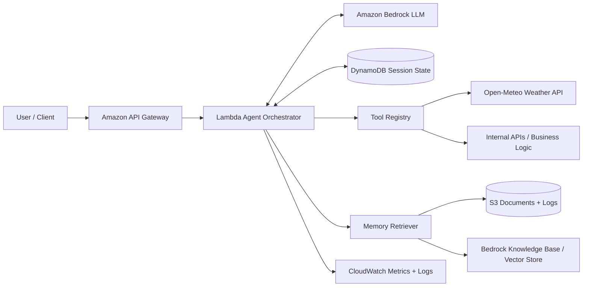
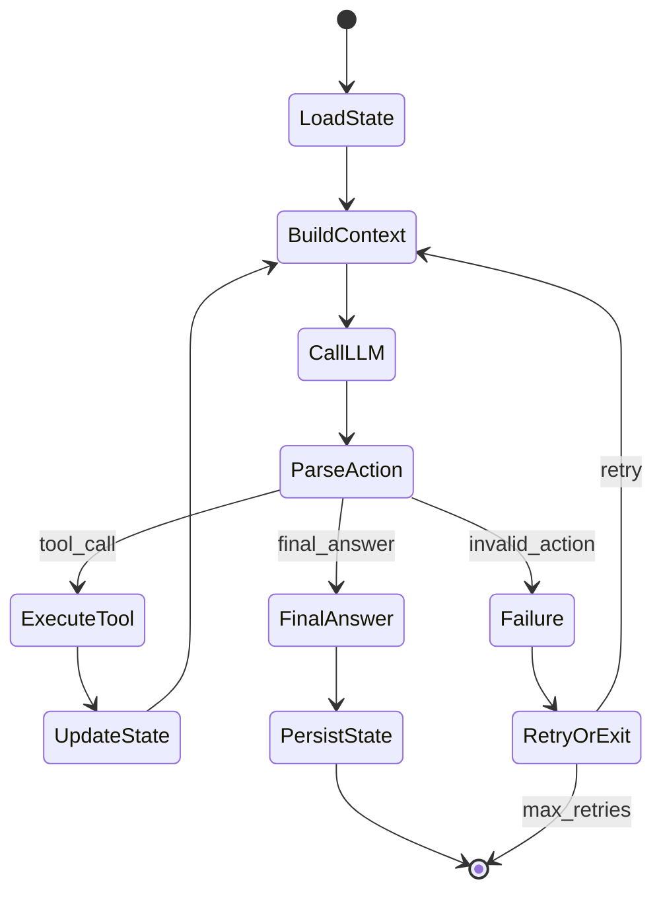

# Agentic LLM System on AWS

An end-to-end reference project for building an **agentic AI system** with LLM reasoning, tool execution, memory, evaluation, and AWS deployment.

> Core idea: an agent is not “just a prompt.” It is a controlled loop over state, powered by an LLM, grounded by tools.


## Visual architecture


This project now includes a **real API tool** using Open-Meteo, so the agent can call live weather data instead of only mock functions.

Try it locally:

```bash
python - <<'PY'
from src.tools.weather_tool import get_current_weather
print(get_current_weather("Seattle"))
PY
```

Example request:

```json
{
  "session_id": "demo-weather-1",
  "query": "What is the current weather in Seattle?"
}
```

## What this project teaches

- How to design an agent control loop
- How to represent agent state
- How tool calling works safely
- How memory/RAG fits into agentic systems
- How to deploy the system using AWS services
- How to evaluate latency, reliability, and task success

## Architecture



## Agent loop



## AWS components

| Component | AWS Service | Why it exists |
|---|---|---|
| API layer | API Gateway | Public HTTPS entry point |
| Orchestration | Lambda | Runs the agent control loop |
| LLM inference | Amazon Bedrock | Calls foundation models |
| Short-term state | DynamoDB | Stores session and intermediate steps |
| Long-term memory | S3 + Bedrock Knowledge Bases | Stores/retrieves documents for RAG |
| Tools | Lambda functions / APIs | Lets the agent act on external systems |
| Monitoring | CloudWatch | Logs latency, failures, token usage |

Amazon Bedrock Agents can orchestrate interactions between foundation models, data sources, applications, and user conversations; agents can call APIs and invoke knowledge bases for supplementary information. Bedrock Knowledge Bases support RAG over proprietary data and can return citations. See `docs/references.md`.

## Repo structure

```text
agentic-llm-aws-project/
├── README.md
├── docs/
│   ├── architecture.md
│   ├── concepts.md
│   ├── evaluation.md
│   ├── references.md
│   └── diagrams/
│       ├── architecture.mmd
│       ├── sequence.mmd
│       └── state-machine.mmd
├── src/
│   ├── agent/
│   │   ├── orchestrator.py
│   │   ├── prompts.py
│   │   ├── schemas.py
│   │   └── state.py
│   ├── tools/
│   │   ├── registry.py
│   │   └── sample_tools.py
│   ├── memory/
│   │   └── retriever.py
│   └── api/
│       └── handler.py
├── infra/
│   └── template.yaml
├── tests/
│   └── test_agent_loop.py
└── examples/
    └── request.json
```

## Local quickstart

```bash
python -m venv .venv
source .venv/bin/activate
pip install boto3 pydantic pytest
pytest
```

For AWS deployment, configure credentials and deploy the `infra/template.yaml` using AWS SAM or CloudFormation.


## Next improvements

- Add Bedrock model invocation implementation
- Add OpenTelemetry tracing
- Add eval dataset and scoring harness
- Add authentication with Cognito
- Add guardrails for prompt injection and unsafe tool use
