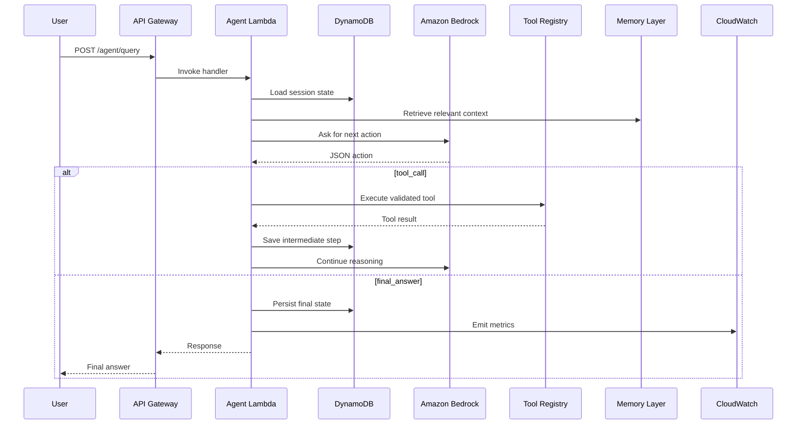

# Architecture Deep Dive

## Mental model

An agentic system has four main parts:

1. **Controller**: deterministic code that owns the loop.
2. **LLM**: probabilistic reasoning engine.
3. **Tools**: deterministic functions that interact with the world.
4. **Memory**: retrieved context that helps the agent act with history.

The most important design decision is this:

> Do not let the LLM own the system boundary. Let your code own the boundary.

## Request flow

## Why AWS?

This project uses AWS because the system maps naturally to managed primitives:

- **Lambda** is good for stateless orchestration.
- **DynamoDB** is good for low-latency session state.
- **S3** is good for logs and document storage.
- **Bedrock** provides managed access to foundation models and agent-related capabilities.
- **CloudWatch** gives operational visibility.

